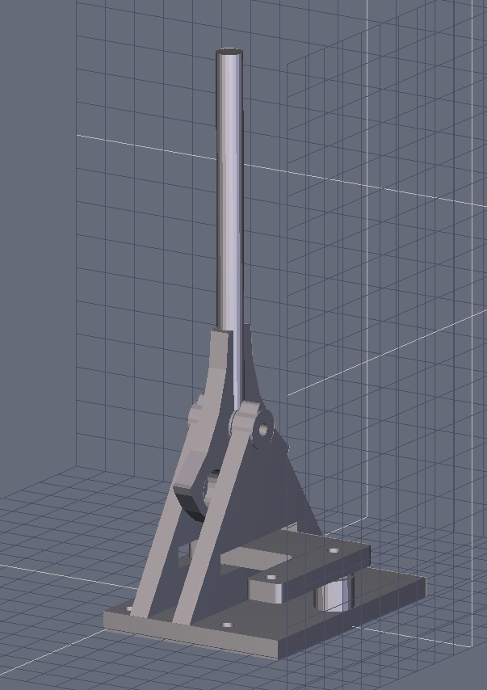

# switchthrow
3D files for G scale Switch Throw

A simple switch throw for Gscale sized turnouts.  Uses three 1/4 inch neodymium magnets to hold at the two positions.

It was designed with Hexagon, a free 3D program available at:

https://www.daz3d.com/hexagon-2-5-download-version

I printed mine on a stock Creality Ender 3 using ABS.

